# Утилиты zip и find
[](https://travis-ci.org/DmitriyYugai/job4j_design)
[](https://codecov.io/gh/DmitriyYugai/job4j_design)

# Содержание
1. [Утилита zip](#Утилита-zip)
2. [Утилита find](#Утилита-find)
## Утилита zip
* [Использованные технологии](#tech_zip)
* [О проекте](#about_zip)
* [Сборка](#build_zip)
* [Использование](#usage_zip)
* [Контакты](#Контакты)
### <a name="tech_zip"></a> Использованные технологии
* Collections Framework
* Java IO
* Java NIO
* Классы из пакета java.util.zip
### <a name="about_zip"></a> О проекте
Данный проект предназначен для архивирования указанной папки. Есть возможность передать 
в качестве ключа расширение файлов, которые не нужно включать в архив.
При архивировании также сохраняется вся структура подпапок. Исходный код проекта располагается в папке
\chapter_002\src\main\java\ru\job4j\io\zip. Пример запуска:
```
java -jar zip.jar -d C:\project -e txt -o C:\project.zip
```
-d - directory - которую нужно архивировать<br>
-e - exclude - исключить файлы *.txt<br>
-o - output - расположение конечного архива<br>
Проект построен на основе трёх классов: ArgZip, Zip, ZipVisitor. Общая диаграмма зависимости классов:<br><br>
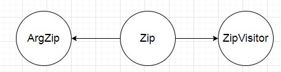<br><br>
1. Класс ArgZip:<br><br>
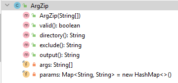<br><br>
Предназначен для работы с входными аргументами - осуществляет валидацию входных параметров, 
а также извлекает значения соответствующих ключей.<br><br>
2. Класс Zip:<br><br>
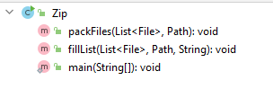<br><br>
Это главный класс - обходит файловую систему, исключая не нужные файлы, 
а также осуществляет упаковку.<br><br>
3. Класс ZipVisitor:<br><br>
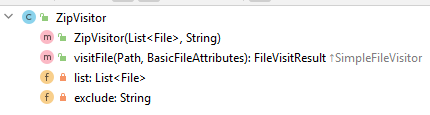<br><br>
Представляет собой вспомогательный класс для обхода файловой системы.
### <a name="build_zip"></a> Сборка
1. Скачать и установить JDK 14.
2. Скачать исходный код проекта.
3. Перейти в директорию \chapter_002\src\main\java\ru\job4j\io\zip, 
которая располагается в папке скачанного проекта.
В данной директории располагается исходный код проекта zip:<br><br>
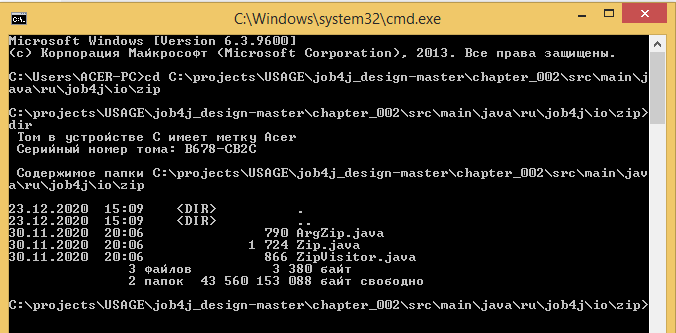<br>
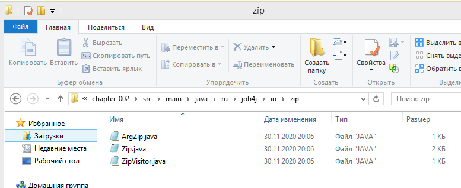<br><br>
4. Компилируем исходый код проекта с помощью утилиты javac из JDK:<br><br>
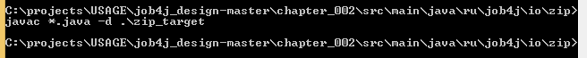<br><br>
Теперь должна появиться target-директория с байт-кодом проекта:<br><br>
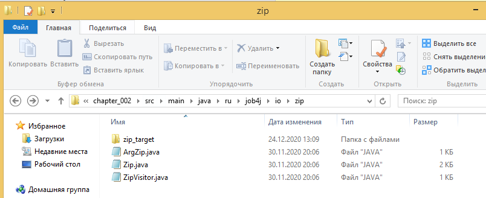<br><br>
5. Переходим в target-директорию и создаём в ней файл манифеста:<br><br>
<br>
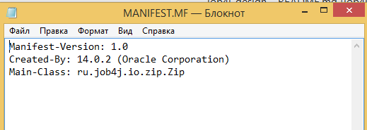<br><br>
6. Переходим в target-директорию в консоли и с помощью утилиты jar из JDK 
упаковываем проект в jar-архив:<br><br>
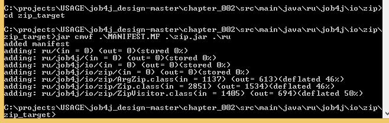<br><br>
Теперь должен появиться jar-архив:<br><br>
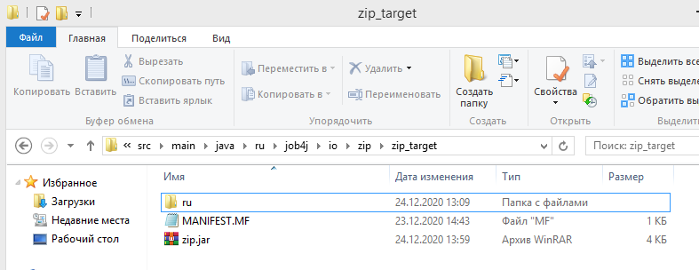<br><br>
7. Проверим содержимое файла манифеста в jar-архиве. 
Откроем его с помощью WinRaR:<br><br>
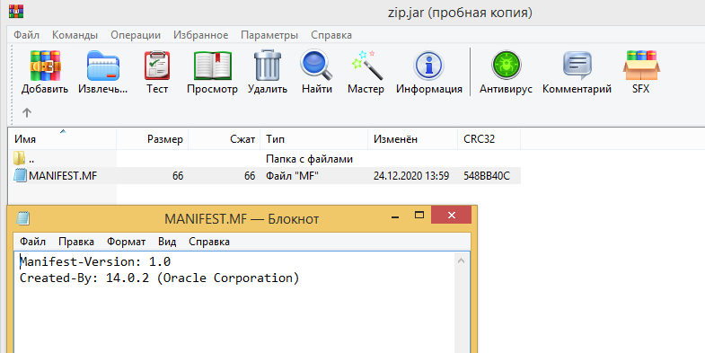<br><br>
Как видно отсутствует строчка с указанием главного класса. 
Вставим эту строчку вручную и обновим архив:<br><br>
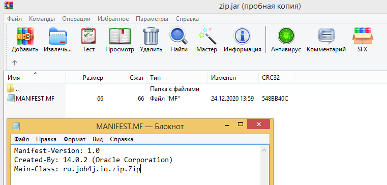<br>
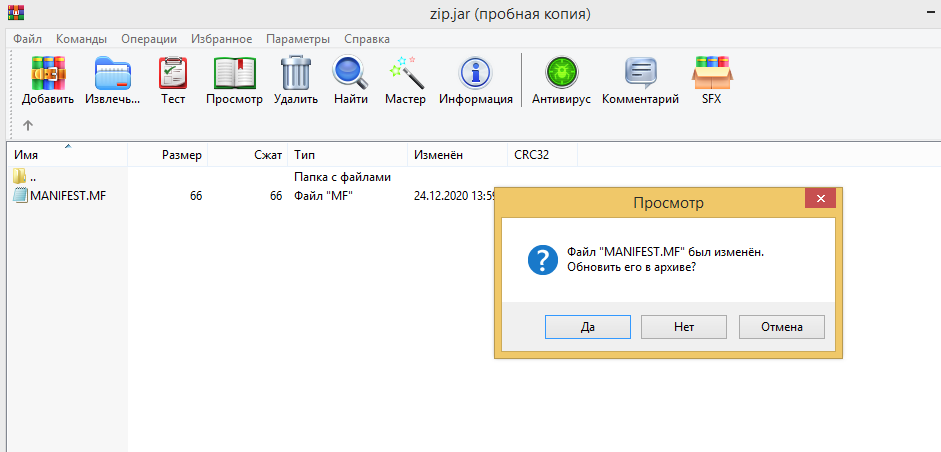<br><br>
Проект успешно собран. Теперь можно проверить его работу.
### <a name="usage_zip"></a> Использование
Архивируем папку zip_test, запустив созданный нами ранее jar-архив проекта:<br><br>
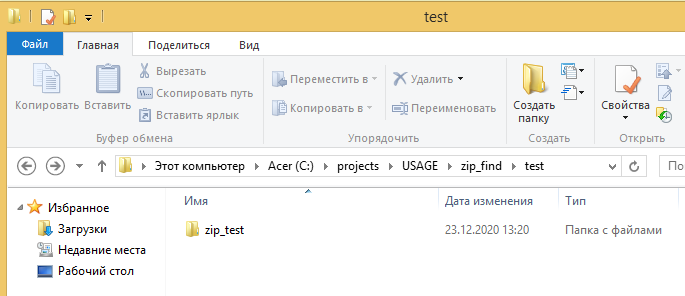<br><br>
<br><br>
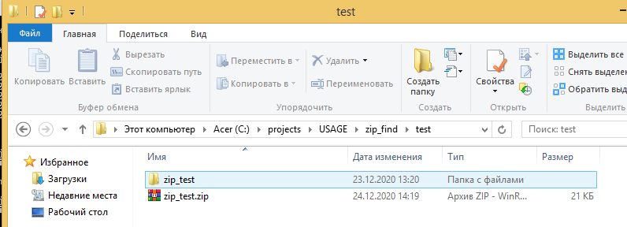<br><br>
Распаковав полученный архив, можно убедиться, что в нём отсутствуют файлы с расширением .txt.
## Утилита find
* [Использованные технологии](#tech_find)
* [О проекте](#about_find)
* [Сборка](#build_find)
* [Использование](#usage_find)
* [Контакты](#Контакты)
### <a name="tech_find"></a> Использованные технологии
* Collections Framework
* Java IO
* Java NIO
* Java Functional interfaces (java.util.function)
### <a name="about_find"></a> О проекте
Данный проект предназначен для поиска файлов в заданном каталоге и подкаталогах. 
Имя файла может задаваться целиком, по маске или по регулярному выражению. Результат поиска записывается в выходной файл.
Также присутствует валидация входных параметров. Исходный код проекта располагается в папке 
\chapter_002\src\main\java\ru\job4j\io\find. Пример запуска:
```
java -jar find.jar -d C:\projects -n file_name (-f or -m or -r) -o C:\projects\output.txt")
```
-d - директория, в которой нужно начинать поиск;<br>
-n - имя файла, маска, либо регулярное выражение;<br>
-m - искать по маске, либо -f - полное совпадение имени, либо -r - регулярное выражение.<br><br>
Проект построен на основе трёх классов: ArgFind, Find, FindVisitorFull. Общая диаграмма зависимости классов:<br><br>
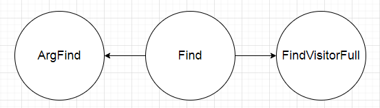<br><br>
1. Класс ArgFind:<br><br>
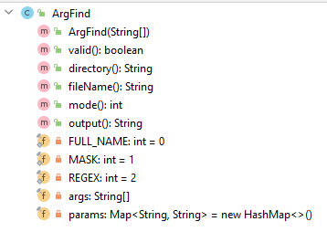<br><br>
Предназначен для работы с входными аргументами - осуществляет валидацию входных параметров, 
извлекает значения соответствующих ключей и режим работы утилиты.<br><br>
2. Класс Find:<br><br>
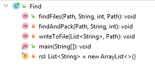<br><br>
Это главный класс - ищет указанные файлы в указанной папке (в зависимости от режима работы утилиты по предикату), формирует список из найденных файлов
 и записывает этот список в выходной файл. <br><br>
3. Класс FindVisitorFull:<br><br>
<br><br>
Представляет собой вспомогательный класс для обхода файловой системы.
### <a name="build_find"></a> Сборка
1. Скачать и установить JDK 14.
2. Скачать исходный код проекта.
3. Перейти в директорию \chapter_002\src\main\java\ru\job4j\io\find, 
которая располагается в папке скачанного проекта.
В данной директории располагается исходный код проекта find:<br><br>
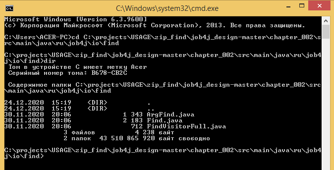<br>
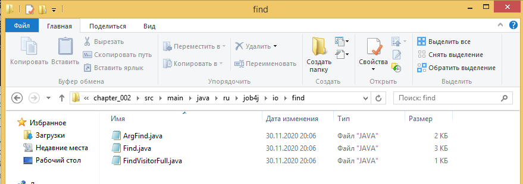<br><br>
4. Компилируем исходый код проекта с помощью утилиты javac из JDK:<br><br>
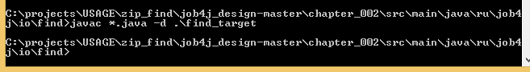<br><br>
Теперь должна появиться target-директория с байт-кодом проекта:<br><br>
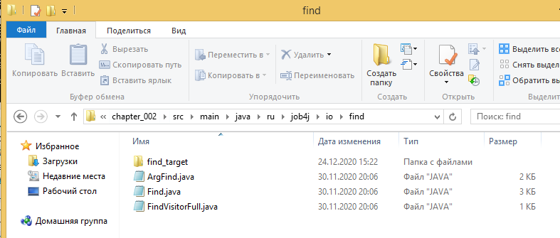<br><br>
5. Переходим в target-директорию и создаём в ней файл манифеста:<br><br>
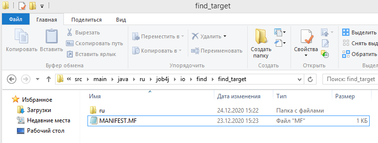<br>
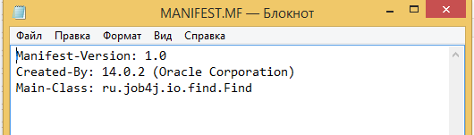<br><br>
6. Переходим в target-директорию в консоли и с помощью утилиты jar из JDK 
упаковываем проект в jar-архив:<br><br>
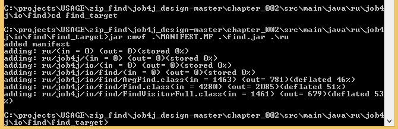<br><br>
Теперь должен появиться jar-архив:<br><br>
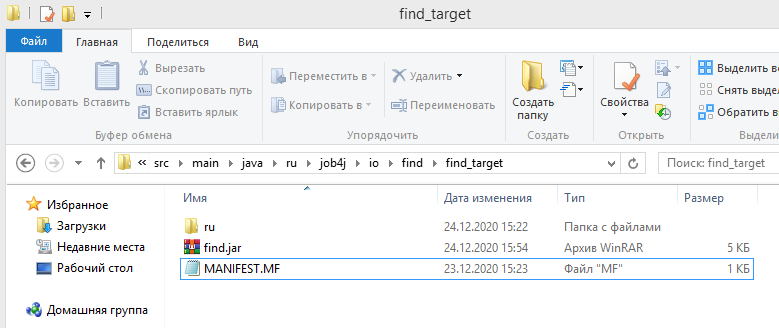<br><br>
7. Проверим содержимое файла манифеста в jar-архиве. 
Откроем его с помощью WinRaR:<br><br>
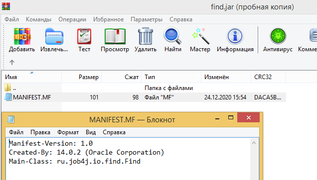<br><br>
Как видно, строчка с указанием главного класса присутствует. 
Если же эта строчка отсутствует, то её необходимо вставить в файл манифеста и обновить архив.<br><br> 
Проект успешно собран. Теперь можно проверить его работу.
### <a name="usage_find"></a> Использование
Произведём поиск файлов с расширением .txt в папке find_test, запустив созданный нами ранее jar-архив проекта:<br><br>
<br><br>
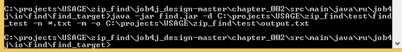<br><br>
<br><br>
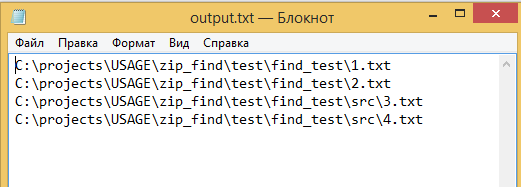<br><br>
Как видно, программа успешно отработала и создала выходной файл со всеми искомыми файлами.
### Контакты
Почта: studentnstu97@mail.ru<br>
Skype: live:.cid.9cdc925fb48220b4
